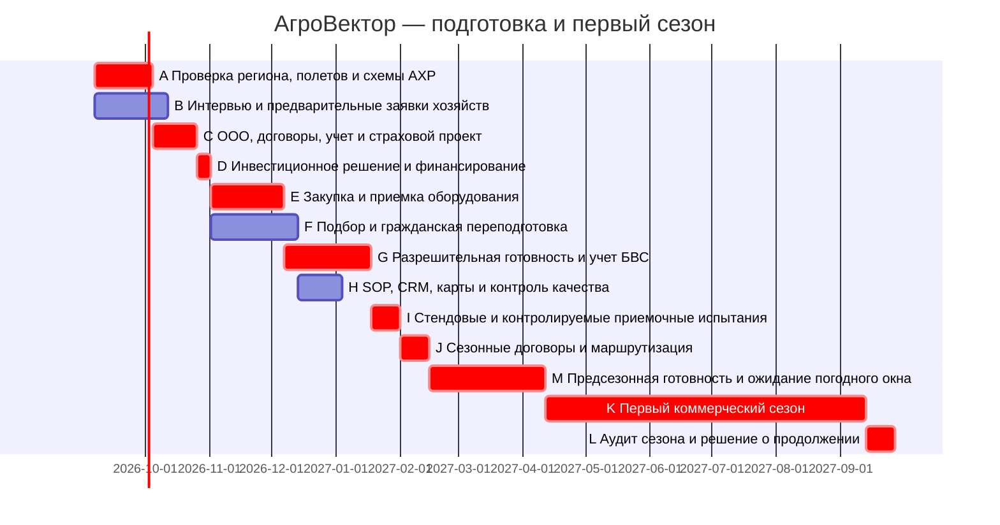
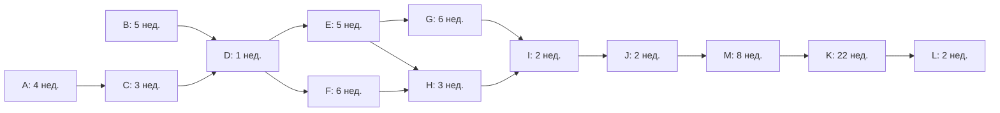

# АгроВектор

## Инвестиционный бизнес-план ранней стадии

Сервис применения сельскохозяйственных дронов для мониторинга посевов и точечного внесения удобрений, средств защиты растений и биопрепаратов.

Версия 05.09.2026 · Плановый горизонт 2027–2031 · Валюта: рубли РФ.

**Статус:** инвестиционная гипотеза до пилота; продажи, разрешения и финансирование не подтверждены. **Рекомендация:** условное поэтапное финансирование, а не безусловная закупка флота.

**Маркировка:** [ФАКТ] — проверенный внешний источник; [РАСЧЕТ] — результат модели; [ДОПУЩЕНИЕ] — проектное решение или еще не подтвержденная гипотеза. Маркер в начале абзаца или перед таблицей распространяется на весь абзац/таблицу, если строка не помечена иначе.

## 1. Резюме

[ДОПУЩЕНИЕ] АгроВектор — мобильный сервис для малых и средних сельхозпредприятий и фермерских хозяйств. Клиент покупает не дрон, а согласованное обследование, карту проблемных зон, точечное внесение жидких удобрений, СЗР, биопрепаратов или энтомофагов и отчет о работе. Агрохолдинги рассматриваются как вторичный сегмент. Полноценное водное орошение исключено: конструкция сервиса ориентирована на малые объемы технологических составов, а не доставку поливной воды.

[ДОПУЩЕНИЕ] Базовый кластер — Татарстан, радиус до 150 км, только после проверки полетной и агрохимической доступности конкретных участков. Одна бригада, основной и резервный агродроны, отдельный мониторинговый аппарат. Первый коммерческий сезон — апрель–сентябрь 2027; подготовка начинается осенью 2026. Контракты, разрешения, поставщики и инвестиции пока не подтверждены.

[ДОПУЩЕНИЕ] Социальная составляющая — добровольная гражданская переподготовка людей с опытом управления БПЛА после СВО для работы в АПК. Общие требования к компетенциям, безопасности и допускам одинаковы для всех сотрудников; прежний опыт не заменяет профессиональную подготовку.

[РАСЧЕТ] Ключевые показатели условного базового сценария:

| Показатель | Значение |
| --- | --- |
| Начальная потребность | 9 500 000 руб. |
| CAPEX / запуск / ликвидность | 7 000 000 / 500 000 / 2 000 000 руб. |
| Выручка 2027 / EBITDA2027 | 8 800 000 / 1 960 000 руб. |
| NPV за 5 лет, ставка 24% | 3 946 443 руб. |
| Простая / дисконтированная окупаемость | 2,68 / 3,88 года |

[ДОПУЩЕНИЕ] Рекомендация инвестору — условное поэтапное финансирование. Не закупать весь парк без юридического заключения по региону, подтверждения кадрового бюджета и коммерческого портфеля. Положительная NPV не компенсирует отсутствие права на работы. Мониторинг без внесения не объявляется равноценной финансовой заменой: такой вариант требует отдельной малокапитальной модели.

## 2. SMART-цели

[ДОПУЩЕНИЕ] Цель «АгроВектора» — подготовить к весне 2027 года юридически допустимый сервис агромониторинга и точечного внесения, проверить платежеспособный спрос и провести первый сезон без расширения команды сверх подтвержденной загрузки. Татарстан и радиус обслуживания до 150 км рассматриваются условно: окончательная территория определяется после юридической проверки конкретных работ и маршрутов.

| SMART-цель | Измеримый результат | Срок и подтверждение |
|---|---|---|
| Проверить применимость модели | Письменная карта разрешений, ограничений и оснований отказа | До go/no-go в 2026 году; заключение юриста |
| Подтвердить спрос | 20 интервью; предварительные заявки на 6000 га-проходов | До финансирования; реестр контактов и заявок |
| Сформировать портфель | 10 клиентов со средним объемом 600 га-проходов | До старта сезона; договоры и согласованные окна |
| Обеспечить готовность | Техника принята, два оператора обучены, регламенты проверены | До 12 апреля 2027 года; акты, проверка компетенций, разрешительная готовность |
| Выполнить первый сезон | 6000 га-проходов внесения и 4000 га-обследований | Сезон 2027 года; подписанные акты и журналы |
| Проверить социальную модель | Открытый добровольный отбор, индивидуальное обучение и наставничество | К началу работ; документированная оценка каждого кандидата |

[ДОПУЩЕНИЕ] Показатель безопасности — отсутствие работ без необходимой готовности и обязательная регистрация опасных событий, включая предотвращенные. Для социальной программы не устанавливается квота, способная подменить профессиональный отбор. Успешность оценивается по освоению гражданских компетенций и устойчивости занятости, а не по биографическому статусу. Коммерческие цели не отменяют право остановить небезопасную работу.

## 3. Описание продукта и стратегическая канва

[ДОПУЩЕНИЕ] Продукт — договорная услуга: обследование поля, согласование карты задания, точечное внесение удобрений, СЗР, биопрепаратов либо выпуск энтомофагов при подтвержденной применимости оборудования и технологии, затем отчет о выполнении. Особый сценарий — локальные и труднодоступные участки, для которых клиент рассматривает альтернативу своему обычному способу обработки. Орошение и продажа дронов в модель не входят.

[ДОПУЩЕНИЕ] Заказчик предоставляет препараты и необходимые сведения о поле; внешний агроном проверяет агрономическую постановку задачи. Исполнитель отвечает за согласованное выполнение, прослеживаемость и документацию, но не обещает универсального роста урожайности. Отчет содержит объем, параметры задания и отклонения.

[ДОПУЩЕНИЕ] Стратегическая канва ниже — гипотеза позиционирования, не исследование конкретных конкурентов. Шкала 1–5 означает предполагаемую выраженность полезного клиенту свойства; оценки требуют проверки интервью и коммерческими предложениями. Сравниваются четыре альтернативы решения одной задачи.

| Критерий | АгроВектор | Наземный подрядчик | Собственная техника хозяйства | Узкий подрядчик БПЛА |
|---|---:|---:|---:|---:|
| Удобство заказа небольшого локального объема | 5 | 2 | 3 | 4 |
| Работа со сложной геометрией участка | 5 | 2 | 3 | 4 |
| Связка обследования и задания | 5 | 2 | 3 | 3 |
| Прослеживаемый отчет | 5 | 3 | 3 | 3 |
| Отсутствие капитальных вложений клиента | 5 | 5 | 1 | 5 |
| Управляемость сезонной доступности | 3 | 3 | 5 | 3 |
| Широта применимых технологий | 3 | 4 | 4 | 3 |

[ДОПУЩЕНИЕ] Канва не подтверждает абсолютного превосходства: у проектного сервиса ограничены сезонная доступность и технологическая универсальность. Поэтому обещание клиенту строится вокруг подходящего задания и проверяемого результата, а не вокруг замены всех наземных операций.

## 4. Business Model Canvas

[ДОПУЩЕНИЕ] Business Model Canvas фиксирует проверяемые гипотезы раннего проекта. До подтверждения договоров указанные сегменты и партнерства не считаются сформированным рынком сбыта.

| Блок | Содержание модели | Проверка гипотезы |
|---|---|---|
| 1. Потребительские сегменты | Хозяйства в разрешенной зоне Татарстана; агрономические службы с локальными задачами, сложными участками и дефицитом подходящих окон | Интервью по конкретным полям, культурам и календарям |
| 2. Ценностное предложение | Мониторинг, карта задания, подходящее точечное внесение и отчет в одном договорном контуре | Платный пилот, согласованные критерии приемки |
| 3. Каналы | Прямые продажи директора, рекомендации агрономов, демонстрации на согласованных площадках | Стоимость привлечения и переход заявки в договор |
| 4. Отношения с клиентами | Персональное планирование сезона, единый контакт, уведомления о переносах, разбор отклонений | Продление договора и реестр претензий |
| 5. Потоки доходов | Оплата внесения за га-проход; отдельная оплата согласованного мониторинга за га-обследование | Акты, отсутствие повторного выставления одного объема |
| 6. Ключевые ресурсы | Одна бригада, основной и резервный аппараты внесения, мониторинговый аппарат, транспорт, документы и оборотный резерв | Приемка, ресурсный календарь и кассовый план |
| 7. Ключевые действия | Продажи, правовая проверка, планирование, подготовка задания, безопасное исполнение, обслуживание и отчетность | Регламенты, журналы и контроль качества |
| 8. Ключевые партнеры | Внешний агроном, учебный партнер, сервис техники, юрист, бухгалтер; поставщики препаратов взаимодействуют с клиентом | Договоры, квалификация, сроки реакции |
| 9. Структура затрат | Техника, труд, транспорт, обслуживание, страхование, обучение, внешние специалисты и резерв ликвидности | Сметы, предложения поставщиков, ежемесячный план-факт |

[ДОПУЩЕНИЕ] Выпуск энтомофагов относится к согласованной операции внесения, а не формирует третью строку выручки. Повторный проход учитывается только при отдельном задании и фактическом выполнении. Площадь мониторинга может совпадать с обработанными полями; это разные услуги, но не дополнительные уникальные гектары территории.

## 5. Маркетинговый план

[ДОПУЩЕНИЕ] Приоритет — КФХ и малые/средние сельхозпредприятия с фрагментированными полями, культурами высокой ценности, переувлажненными участками и недостаточной собственной техникой. Покупатель — руководитель хозяйства; технический заказчик и приемщик — агроном. Агрохолдинги — вторичный сегмент для пиков нагрузки и сложных участков, а не якорь первого сезона.

### Размер рынка: сценарный расчет снизу вверх

[ДОПУЩЕНИЕ] Открытого реестра оплаченных гектаров услуг агродронов и проверенной базы потенциальных клиентов в выбранном радиусе нет. Поэтому приведен проверяемый сценарий адресуемого спроса, **не установленный размер российского рынка и не прогноз отраслевого агентства**. Перед инвестиционным решением каждое хозяйство SAM должно быть подтверждено в CRM.

[ДОПУЩЕНИЕ] TAM — расчетная корзина из 2000 хозяйств РФ по 2000 га; лишь 15% площади допускается к рассматриваемым услугам с учетом агрономии, полетной доступности и готовности отдавать работу подрядчику. На пригодный гектар — 1,5 оплаченного прохода внесения и 0,5 обследования в год. SAM — подмножество 200 хозяйств по 2000 га в доступном кластере Татарстана и радиусе до 150 км при тех же фильтрах. Это гипотезы, не подсчитанные хозяйства; юридически недоступные участки исключаются. Цены постоянные, 2027 года, без НДС.

[РАСЧЕТ]

| Уровень | Пригодная площадь, га | Га-проходы внесения | Га-обследования | Рубли в год |
|---|---:|---:|---:|---:|
| TAM сценарный | 600000 | 900000 | 300000 | 1245000000 |
| SAM сценарный | 60000 | 90000 | 30000 | 124500000 |
| SOM первого сезона | Не суммируется между услугами | 6000 | 4000 | 8800000 |

[РАСЧЕТ] Формула TAM: 2000 × 2000 × 15% × (1,5 × 1300 + 0,5 × 250). SAM — та же формула для 200 хозяйств. SOM — 10 клиентов × 600 га-проходов × 1300 + 4000 га-обследований × 250. План занимает 6,67% сценарных га-проходов SAM и 7,07% его денежного объема. Это целевые доли будущей выручки, не текущая доля компании. Повторные проходы не считаются уникальными гектарами; мониторинг тех же полей — другая оплаченная операция, а не прирост земли.

### Выход на рынок

[ДОПУЩЕНИЕ] Каналы: прямые продажи через агрономов, партнеры по биопрепаратам и удобрениям, фермерские объединения, демонстрации на поле и рекомендации. Плановая воронка: 100 адресных контактов → 40 квалифицированных разговоров → 20 обследований/предложений → 10 сезонных клиентов. Ни одно соглашение пока не подписано. Предварительное интервью не считается продажей.

[ДОПУЩЕНИЕ] Годовой маркетинговый бюджет 240000 руб. входит в постоянный OPEX. Денежный CAC при 10 новых клиентах — 24000 руб. без распределения зарплаты директора; это не fully-loaded CAC. Средняя выручка на клиента в первом сезоне — 880000 руб. при условном распределении всех услуг между десятью клиентами. Агрономические консультации, дорога в согласованном радиусе и отчет включены; дальний выезд и малый участок требуют отдельной сметы и не заложены как дополнительная выручка.

[ДОПУЩЕНИЕ] Коммерческие условия: минимальный планируемый маршрут 100 га-проходов, 30% аванс, остаток после акта; модель ликвидности консервативно не опирается на аванс. Ценность проверяется на сопоставимых контрольных участках: сроки, площадь, качество покрытия, повреждение колеи, расход состава. Процент экономии СЗР и прирост урожая до испытаний не обещаются.

[ДОПУЩЕНИЕ] Контроль спроса: если к решению о закупке нет подтвержденного доступного портфеля на 6000 га-проходов, капиталоемкий запуск переносится; допускается отдельный малый пилот через законного оператора. Его экономика не подменяет базовую модель собственной бригады.

### Наблюдаемая отрасль и динамика

[ФАКТ] Министр сельского хозяйства сообщила об около 600 тыс.га полей, обработанных агродронами в 2025 году.[8] РСХБ в публикации 16.07.2026 приводит 781 тыс.га за 2025 год и прогноз 1058 тыс.га на 2026 год.[9]

[ДОПУЩЕНИЕ] Источники расходятся по 2025 году; охват и правила учета проходов недостаточно раскрыты. Их нельзя объединять в один ряд или выдавать прогноз 2026 за выполненные работы. Сопоставимый первичный национальный итог 2024 не подтвержден. Площади включают не только внешние платные услуги, поэтому умножение отраслевой площади на наш тариф не является доказанным объемом сервисного рынка. Приведенный выше TAM — сценарная будущая корзина, а не текущая платная выручка отрасли.

[РАСЧЕТ] Внутри оценки РСХБ прогнозный рост 2026 к 2025 составляет 35,47% (1058/781−1), но этот темп не переносится на финансовую модель АгроВектора: ее выручку определяют собственные гектары, тариф и мощность. Плановый средний CAC24000 руб. и выручка 880000 руб. на клиента рассчитаны как 240000/10 и 8800000/10 соответственно.

## 6. Анализ конкурентов

[ФАКТ] Сопоставлены публичные предложения пяти сервисов. Дата проверки 05.09.2026; сведения — заявления самих поставщиков, не подтверждение действующих допусков, выручки или качества. Н/д означает отсутствие подтвержденной цифры, а не нулевую цену или долю.

| Компания | География и услуга | Цена,руб./га | Доля рынка,% | Источник |
|---|---|---|---|---|
| BeeAir / BeeUAV | Татарстан заявлен на сайте; контактный адрес МО; обработка; мониторинг; аренда | Н/д; по запросу | Н/д | [1][2] |
| ГК Агропрофи / XAG | Поволжье включая Татарстан; обработка; посев; продажа техники | Н/д; по запросу | Н/д | [3][4] |
| Аграс / аграс.рф | Челябинская область и Урал по материалам сайта; аренда пилота/техники; демонстрация | Н/д; по запросу | Н/д | [5] |
| Гермес | Краснодарский край и Адыгея; виноградники; удобрения; мониторинг | Н/д; по запросу | Н/д | [6] |
| Агродроны ЮФО | ЮФО; контакт в Элисте; обработка полей; внесение; посев | 900 | Н/д | [7] |

[ФАКТ] «Агродроны ЮФО» называют в среднем 900 руб./га с индивидуальным расчетом по виду обработки и объему. НДС в тарифе не раскрыт; публикация не является коммерческим предложением для поля в Татарстане.[7] BeeAir/BeeUAV заявляет Татарстан, но указывает контактный адрес в Московской области; реальное покрытие региона необходимо уточнить.[1][2]

[ДОПУЩЕНИЕ] Наземные подрядчики и собственный опрыскиватель хозяйства — заменители, не участники одного статистически измеренного рынка агродронных услуг. Их сравнивают по полной смете одного задания: доступность поля, календарь, препарат, норма внесения, транспорт, отчет и ответственность. Международные производители дронов не подменяют российских исполнителей услуги.

[РАСЧЕТ] Тариф АгроВектора 1300 руб. выше единственного подтвержденного публичного ориентира 900 руб. на 44,44%. Сравнение не выровнено по региону, составу услуги и НДС; премия требует подтверждения оплатой пилота. Стресс 900 руб. приведен в разделе 18 и дает отрицательную NPV. Демпинговое позиционирование в проекте не используется.

[ДОПУЩЕНИЕ] Фактические выручки и знаменатель регионального рынка не раскрыты, поэтому именованные доли не присваиваются и круговая диаграмма выдуманных долей не строится. Целевая доля АгроВектора 7,07% относится исключительно к сценарному денежному SAM раздела 5. Для рыночного подтверждения нужны реестр доступных хозяйств, сопоставимые КП минимум трех подрядчиков и фактические гектары оплаченных работ.

## 7. Развернутый SWOT

[ДОПУЩЕНИЕ] SWOT отражает внутреннюю конструкцию проекта и сценарии внешней среды, а не доказанные преимущества действующей компании.

| Группа | Фактор | Коммерческое последствие | Управленческое действие |
|---|---|---|---|
| S | Связка мониторинга, задания и отчета | Возможность продавать понятный результат | Единый паспорт заказа и критерии приемки |
| S | Резервный аппарат внесения | Снижение зависимости от единичного отказа | Проверять готовность резерва перед выездом |
| S | Компактная команда | Короткая цепочка согласования | Закрепить полномочия остановки работ |
| W | Отсутствие подтвержденного портфеля | Риск недозагрузки после закупки | Условное инвестиционное решение после проверки заявок |
| W | Одна бригада и совмещение ролей | Конфликты сроков и зависимость от людей | Единый календарь, ограничение принимаемых обязательств |
| W | Экономный фонд труда | Риск вакансий, текучести и перегрузки | Проверить предложения кандидатам до закупок |
| O | Неудовлетворенные локальные задачи клиентов | Возможность повторных заказов | Проверять проблему на конкретном поле |
| O | Гражданская переподготовка кандидатов с опытом БПЛА | Потенциальный кадровый канал | Добровольный отбор и обучение на равных условиях |
| T | Ограничения полетов и технологий | Невозможность исполнения части договоров | Юридический стоп-фактор и прозрачные условия переноса |
| T | Несовпадение погоды и агрономических окон | Потеря объемов без технической поломки | Приоритеты заданий, запас времени, отказ от перегруза |
| T | Ценовое давление или задержка оплаты | Снижение маржи и кассовый разрыв | Авансирование, проверка дебиторской задолженности |

[ДОПУЩЕНИЕ] SO-стратегия — тестировать комплексное предложение на локальных задачах; WO — закрывать дефицит компетенций наставником и внешним агрономом. ST — использовать отчетность и технический резерв для управляемого исполнения. WT — не расширять парк и географию до подтверждения юридической доступности, кадров и фактической экономики сезона.

## 8. Пять сил Портера

[ДОПУЩЕНИЕ] Пять сил Портера оцениваются сценарно; уровни не являются результатом измерения регионального рынка.

| Сила | Уровень гипотезы | Механизм воздействия | Ответ проекта | Что проверить |
|---|---|---|---|---|
| Конкуренция действующих исполнителей | Высокий | Сравнение тарифов и свободных окон | Продавать определенное задание, сроки и приемку | Сопоставимые предложения по одинаковому полю |
| Угроза новых участников | Средний | Появление дополнительной услуги у действующих подрядчиков | Развивать повторные договоры и дисциплину качества | Реальные сроки запуска и стоимость готовности |
| Угроза заменителей | Высокий | Наземная обработка, собственная техника, отказ от операции | Отбирать задачи, где клиент видит ценность сервиса | Полная стоимость и применимость альтернатив |
| Власть покупателей | Высокий | Сезонный торг и концентрация заказов | Разделять объемы по клиентам, фиксировать условия заранее | Концентрацию портфеля и причины отказов |
| Власть поставщиков | Средний–высокий | Зависимость от техники, аккумуляторов и ремонта | Резервный аппарат, запас критичных деталей, сервисный договор | Совместимость, гарантийные условия, сроки ремонта |

[РАСЧЕТ] Гипотеза зависит от повторного спроса и исполнения в сезонном окне. Устойчивое преимущество до полевой проверки не подтверждено.

## 9. Организационно-правовая форма и регуляторный контур

[ДОПУЩЕНИЕ] Предпочтительная форма — ООО: долевое участие инвестора, отделение имущества компании, договорная ответственность и управляемая отчетность. Окончательные ОКВЭД, объект УСН, корпоративный договор и страховой пакет утверждаются с юристом и бухгалтером. Компания не позиционируется как продавец техники. Вход инвестора не означает гарантированного распределения прибыли.

### Обязательные условия законного выполнения работ

[ФАКТ] Статья 33 Воздушного кодекса различает государственный учет гражданских БВС с максимальной взлетной массой от 0,15 до 30 кг включительно и государственную регистрацию аппаратов более 30 кг. Масса определяется не пустым аппаратом и не баком.[15]

[ФАКТ] С 01.09.2026 действуют ФАП по приказу Минтранса 02.07.2026№303, заменившие приказ 494. Они предусматривают сертификат эксплуатанта, эксплуатационную спецификацию, требования к персоналу, организации работ и страхованию; перечень включает авиационно-химические работы. Аппарат до 30 кг не дает общего освобождения коммерческих АХР от требований к эксплуатанту.[16][17]

[ДОПУЩЕНИЕ] Для каждого задания проверяется вся цепочка: законное владение и учет/регистрация конкретного борта → требуемые документы летной годности и персонала → сертификат и соответствующие работы в спецификации → действующие ограничения воздушного пространства и региональные запреты → необходимые разрешения/согласования/план полета → допустимость препарата → безопасность участка. Договор с фермером, малая высота и частная земля не признаются самостоятельными основаниями полета. Проект не имеет подтвержденного участия в ЭПР или индивидуального исключения из запрета. Текущий разрешительный маршрут именно для Татарстана остается незакрытым условием инвестиционного решения.

[ФАКТ] Россельхознадзор указывает необходимость использования зарегистрированных препаратов с соблюдением регламентов применения.[24] Статья 16 закона 490-ФЗ предусматривает обычное уведомление пчеловодов не ранее 10 и не позднее 5 календарных дней до применения пестицидов в пределах 7 км, с установленными законом каналами и содержанием; специальный порядок для ЧС не распространяется автоматически на срочный коммерческий заказ.[22][23]

[ДОПУЩЕНИЕ] Агроном до принятия заказа проверяет актуальный реестр, культуру, вредный объект, разрешенный способ, дозу, норму рабочего раствора, кратность и сроки ожидания. Ни один препарат пока не утвержден для проекта. Разрешенность обычной авиационной обработки не приравнивается к разрешению произвольно уменьшать объем раствора для БАС. Биопрепараты и энтомофаги также требуют проверки их правового статуса, технологии и экологических ограничений. Препараты принимает ответственный специалист; партия и документы прослеживаются. Хранение, смешивание, СИЗ, предотвращение разлива и передача отходов регулируются отдельными SOP и договорными обязанностями; имущество клиента не снимает ответственности исполнителя.

### Переходный санитарный риск 2026

[ФАКТ] Февральские поправки 2026 к СанПиН 2.1.3684-21 предусматривают специальные условия для БАС, включая 700 м в конкретных положениях. С 01.09.2026 введены новые СП 2.2.4285-26 и отменены прежние правила условий труда.[18][19][21]

[ФАКТ] В прочитанной текстовой копии новых СП пункт 287 связывает авиационную защиту культур с отсутствием возможности наземной техники, а пункт 291 предусматривает остановку при обнаружении людей или животных в установленных пределах 2000 м.[27] Это неофициальная текстовая копия; официальный акт найден, но первичный скан полностью построчно не сверен.[20]

[ДОПУЩЕНИЕ] До письменной правовой сверки новых СП и специальных поправок не считать 700 м универсальной зоной безопасности или основанием для любой обработки. Спорные участки исключаются из подтвержденного портфеля. Для каждого поля фиксируются люди, животные, пасеки, водные объекты, соседние культуры, ограничения препарата и погодные пределы оборудования. При любом несоответствии — остановка, безопасное завершение и уведомление ответственных. Уведомление пчеловодов в 7 км не заменяется санитарным расстоянием 700 м.

[ФАКТ] Стратегия развития беспилотной авиации утверждена распоряжением Правительства 21.06.2023№1630-р до 2030 года и на перспективу 2035 года.[26]

[ДОПУЩЕНИЕ] Стратегия — контекст развития отрасли, не индивидуальное разрешение, гарантированная субсидия или госзаказ. В финансовой модели отсутствуют гранты и льготы, не подтвержденные для компании. Правовой раздел является исследовательским основанием для due diligence, а не заключением о допустимости конкретного вылета.

## 10. Стейкхолдеры: власть и интерес

[ДОПУЩЕНИЕ] Матрица власти и интереса используется для распределения коммуникаций. Высокая власть означает способность остановить финансирование, разрешение либо исполнение заказа, а не особый статус участника.

| Стейкхолдер | Власть / интерес | Ожидание или конфликт | Взаимодействие | Ответственный |
|---|---|---|---|---|
| Учредитель | Высокая / высокий | Сохранение капитала и управляемость | Еженедельный контроль запуска, месячный план-факт | Директор |
| Долевой инвестор | Высокая / высокий | Прозрачность расходов и условий участия | Отчетность, согласование крупных решений | Директор |
| Клиенты и их агрономы | Высокая / высокий | Соблюдение окна, качество, понятная приемка | Паспорт поля, календарь, отчет, разбор претензий | Директор и операционный руководитель |
| Уполномоченные органы | Высокая / переменный | Соблюдение применимых требований | Документы и согласования по конкретной территории | Внешний юрист |
| Операторы | Средняя / высокий | Безопасность, оплата, реалистичная нагрузка | Инструктаж, обратная связь, право остановки | Операционный руководитель |
| Кандидаты после СВО | Низкая / высокий | Добровольный переход в гражданскую профессию | Конфиденциальный отбор, наставник, ясные требования | Директор |
| Учебный партнер и агроном | Средняя / высокий | Корректные задания и границы ответственности | Программа обучения, проверка знаний, согласование карт | Операционный руководитель |
| Сервис оборудования | Средняя / средний | Оплата и планируемое обслуживание | Регламент ремонтов, сроки реакции | Операционный руководитель |
| Соседи полей и местное сообщество | Низкая / переменный | Отсутствие недопустимого воздействия | Канал обращений, предусмотренное уведомление | Директор |

[ДОПУЩЕНИЕ] Социальная коммуникация не раскрывает персональную историю сотрудников без согласия и не обещает привилегированного допуска к полетам. Жалобы на безопасность рассматриваются независимо от коммерческой ценности заказа.

## 11. Производственный план

[ДОПУЩЕНИЕ] Производственный контур включает одну бригаду из двух операторов, два аппарата внесения — основной и резервный — и один мониторинговый. Резерв восстанавливает доступность при отказе основного, но не удваивает производительность. Полный цикл заказа: проверка применимости и разрешений → обследование и согласование задания → подготовка техники и материалов клиента → выполнение → контроль и актирование.

[ДОПУЩЕНИЕ] Сезон длится 22 недели. Плановая емкость внесения опирается на 100 эффективных рабочих дней с производительностью 130 га-проходов в день. Это интегральная гипотеза с учетом переездов и подготовки, которую необходимо подтвердить хронометражем. Календарные недели не означают ежедневную летную доступность.

[РАСЧЕТ] 22 недели = 154 календарных дня. В пятом году внесение требует 100 × 130 = 13 000 га-проходов, мониторинг — 20 × 500 = 10 000 га-обследований. Последовательное выполнение занимает 120 полевых рабочих дней; остаются 34 дня погодного и логистического резерва. [ДОПУЩЕНИЕ] Это напряженный потолок, а не гарантированная мощность: производительность мониторинга 500 га в день и достаточность резерва требуют проверки.

| Год | Внесение, га-проходы | Мониторинг, га-обследования |
|---|---:|---:|
| 2027 | 6000 | 4000 |
| 2028 | 9000 | 6000 |
| 2029 | 11000 | 8000 |
| 2030 | 12000 | 9000 |
| 2031 | 13000 | 10000 |

[ДОПУЩЕНИЕ] Мониторинг проводится помощником в отдельных согласованных окнах при сохранении необходимых условий безопасности. Одновременные полеты внесения и мониторинга без отдельной команды недопустимы. Обработка данных переносится в нелетное время; совокупный календарь обеих услуг проверяется до подтверждения заказа. Объемы последних лет являются целями, а не доказательством наличия трудового ресурса.

[ДОПУЩЕНИЕ] Тарифы 2027 года без НДС: 1300 руб. за га-проход внесения и 250 руб. за га-обследование. Препараты клиента не включены. Полевой пилот 100 га проводится в апреле 2027 года внутри 6000 га-проходов первого сезона и не прибавляется повторно. Перед выездом проверяются документы, погода, состояние техники, пригодность материала и согласованный контур. При отклонении задание приостанавливается; повторная работа оформляется по условиям договора, а не автоматически как новая выручка.

[РАСЧЕТ] Проверка совместной мощности:22×7=154 календарных дня; внесение 13000/130=100 дней, мониторинг 10000/500=20 дней, резерв 34 дня. [ДОПУЩЕНИЕ] Производительность мониторинга 500 га/день и 120 полевых дней — напряженный потолок, а не гарантия; работы выполняются последовательно, выходные и нормы отдыха соблюдаются. Полевой пилот 100 га в апреле включен в 6000 га-проходов первого сезона. При невозможности подтвердить такой календарь объемыY4–Y5 снижаются.

## 12. Организационный план

[ДОПУЩЕНИЕ] Штат — 3 FTE: директор, совмещающий продажи и управление финансами; оператор — операционный руководитель; второй оператор, выполняющий также функции помощника. Внешние агроном, юрист и бухгалтер привлекаются по договорам и включаются в бюджет отдельно от штатного фонда труда. Наименования «Продажи» и «Операционный руководитель» в проектных таблицах обозначают функции, а не дополнительные вакансии.

| Роль | Основные обязанности | Ограничение полномочий |
|---|---|---|
| Директор / продажи | Клиенты, договоры, деньги, партнеры, персонал | Не отменяет профессиональный запрет на выполнение |
| Оператор / операционный руководитель | Календарь, техника, безопасность, наставничество | Не заменяет агронома и юридическую проверку |
| Второй оператор / помощник | Подготовка, контроль, мониторинг в отдельных окнах | Самостоятельные действия только после проверки компетенций |
| Внешний агроном | Задания, технологическая применимость, качество | Не предоставляет автоматического разрешения на полеты |
| Внешние юрист и бухгалтер | Правовая готовность, учет, договорные и налоговые вопросы | Работают в согласованном объеме услуг |

[ДОПУЩЕНИЕ] Полная стоимость штатного труда принята на уровне 3 млн руб. в год. Это экономный и рискованный бюджет, требующий проверки начислений, условий кандидатов и сезонной нагрузки; рост обязательных выплат нельзя скрывать за неоплачиваемыми переработками.

[ДОПУЩЕНИЕ] Людям с опытом БПЛА после СВО предлагается добровольная гражданская переподготовка: оценка исходных навыков, обучение агротехнологии и безопасности, работа с наставником, практическая проверка и документированное решение о готовности. Требования одинаковы для всех кандидатов; прежний опыт не означает автоматического допуска. При необходимости предусматривается индивидуальный темп адаптации и добровольное обращение за поддержкой без раскрытия чувствительных данных клиентам.

## 13. WBS / иерархическая структура работ

[ДОПУЩЕНИЕ] WBS формируется из единого набора работ в `scripts/build_plan.py`; табличное представление — `data/project_plan.csv`. Иерархия охватывает проверку модели, финансирование и подготовку ресурсов, предсезонную готовность, коммерческий сезон и итоговый аудит. Каждый пакет имеет проверяемый результат, а не только факт затраченного времени.

[ДОПУЩЕНИЕ] Отдельный пакет M предусматривает восемь недель предсезонной готовности и ожидания погодного окна после J. Приемочные испытания I не подменяются зимней коммерческой обработкой; полевой пилот включается в апрельский сезон. Закупка не разрешает автоматически начинать работы: необходима готовность по G и контроль перед конкретным выездом.

| WBS | ID | Работа | Результат |
| --- | --- | --- | --- |
| 1.1 | A | Проверка региона, полетов и схемы АХР | Письменная карта разрешений и стоп-факторов |
| 1.2 | B | Интервью и предварительные заявки хозяйств | 20 интервью; заявки на 6000 га-проходов |
| 1.3 | C | ООО, договоры, учет и страховой проект | ООО; договоры; страховые предложения |
| 2.1 | D | Инвестиционное решение и финансирование | 9.5 млн руб.; пройден юридический gate |
| 2.2 | E | Закупка и приемка оборудования | Комплектность; серийные номера; акты |
| 2.3 | F | Подбор и гражданская переподготовка | Два оператора; экзамен и допуск |
| 2.4 | G | Разрешительная готовность и учет БВС | Документы на конкретные БВС/работы; либо no-go |
| 3.1 | H | SOP, CRM, карты и контроль качества | Чек-листы; шаблон отчета; аварийный план |
| 3.2 | I | Стендовые и контролируемые приемочные испытания | Акт приемки; полевой пилот 100 га включен в апрельский сезон |
| 3.3 | J | Сезонные договоры и маршрутизация | 10 клиентов; согласованный календарь |
| 3.4 | M | Предсезонная готовность и ожидание погодного окна | Повторная проверка разрешений и погодного окна |
| 4.1 | K | Первый коммерческий сезон | 6000 га-проходов; 4000 га-обследований |
| 4.2 | L | Аудит сезона и решение о продолжении | Факт P&L/ДДС; претензии; продления |

## 14. Диаграмма Ганта

[ДОПУЩЕНИЕ] Диаграмма Ганта должна строиться из того же набора задач, длительностей и зависимостей, что WBS и сетевой график. Базовый старт коммерческого сезона — 12 апреля 2027 года после восьминедельного пакета M; продолжительность сезона K — 22 недели. Это плановый ориентир, а не гарантия летной доступности.

[ДОПУЩЕНИЕ] Параллельность подготовки не означает возможность параллельной загрузки одной бригады в поле. Директор проверяет доступность исполнителей; переносы отражаются в едином календаре и согласуются с клиентами.

[РАСЧЕТ] Календарь в календарных неделях; связи finish-to-start. Начало подготовки 07.09.2026. Даты — план, не выданные разрешения.

| ID | Начало | Окончание | Недели | Резерв, нед. |
| --- | --- | --- | --- | --- |
| A | 2026-09-07 | 2026-10-04 | 4 | 0 |
| B | 2026-09-07 | 2026-10-11 | 5 | 2 |
| C | 2026-10-05 | 2026-10-25 | 3 | 0 |
| D | 2026-10-26 | 2026-11-01 | 1 | 0 |
| E | 2026-11-02 | 2026-12-06 | 5 | 0 |
| F | 2026-11-02 | 2026-12-13 | 6 | 2 |
| G | 2026-12-07 | 2027-01-17 | 6 | 0 |
| H | 2026-12-14 | 2027-01-03 | 3 | 2 |
| I | 2027-01-18 | 2027-01-31 | 2 | 0 |
| J | 2027-02-01 | 2027-02-14 | 2 | 0 |
| M | 2027-02-15 | 2027-04-11 | 8 | 0 |
| K | 2027-04-12 | 2027-09-12 | 22 | 0 |
| L | 2027-09-13 | 2027-09-26 | 2 | 0 |

## 15. Сетевой график

[ДОПУЩЕНИЕ] Сетевая модель использует зависимости «окончание–начало» и длительности в календарных неделях из `scripts/build_plan.py`. Ранние и поздние сроки, резервы и критический путь рассчитываются по единому набору задач; независимо заданные даты в текст не вводятся.

[ДОПУЩЕНИЕ] Связь начала сезона проходит через J → M → K. Пакет M является явной работой ожидания и повторной проверки готовности, а не свободным резервом, который можно автоматически расходовать на задержки. Критический путь не гарантирует разрешений или подходящей погоды.

[РАСЧЕТ] Критический путь: **A → C → D → E → G → I → J → M → K → L**. Продолжительность 55 недель, включая погодный буфер M и первый сезон K. Это плановый CPM, не прогноз срока выдачи документов.

| ID | Предшественники | ES | EF | LS | LF | Резерв |
| --- | --- | --- | --- | --- | --- | --- |
| A | — | 0 | 4 | 0 | 4 | 0 |
| B | — | 0 | 5 | 2 | 7 | 2 |
| C | A | 4 | 7 | 4 | 7 | 0 |
| D | B;C | 7 | 8 | 7 | 8 | 0 |
| E | D | 8 | 13 | 8 | 13 | 0 |
| F | D | 8 | 14 | 10 | 16 | 2 |
| G | E | 13 | 19 | 13 | 19 | 0 |
| H | E;F | 14 | 17 | 16 | 19 | 2 |
| I | G;H | 19 | 21 | 19 | 21 | 0 |
| J | I | 21 | 23 | 21 | 23 | 0 |
| M | J | 23 | 31 | 23 | 31 | 0 |
| K | M | 31 | 53 | 31 | 53 | 0 |
| L | K | 53 | 55 | 53 | 55 | 0 |

## 16. Матрица ответственности RACI

[ДОПУЩЕНИЕ] RACI переносится из единого проектного набора: R — исполнитель, A — ответственный за результат, C — консультируемый, I — информируемый. Для каждой работы сохраняется один A; делегирование исполнения не снимает ответственности за приемку.

[ДОПУЩЕНИЕ] «Продажи» выполняет директор, «Операционный руководитель» — один из двух операторов. Внешний агроном, юрист, бухгалтер и учебный партнер не увеличивают штат до дополнительных FTE, но требуют оплачиваемого времени. Ответственность инвестора за решение о финансировании не означает оперативного руководства полетами. Матрица должна сопровождаться проверкой нагрузки совмещаемых ролей.

| ID | R — выполняет | A — принимает | C — консультирует | I — информируется |
| --- | --- | --- | --- | --- |
| A | Юрист | Директор | Агроном;Операционный руководитель | Инвестор |
| B | Продажи | Директор | Агроном | Инвестор |
| C | Юрист | Директор | Бухгалтер | Инвестор |
| D | Директор | Инвестор | Бухгалтер;Юрист | Команда |
| E | Операционный руководитель | Директор | Агроном | Бухгалтер |
| F | Операционный руководитель | Директор | Учебный партнер;Агроном | Инвестор |
| G | Юрист | Директор | Операционный руководитель | Клиенты |
| H | Агроном | Операционный руководитель | Юрист | Продажи |
| I | Оператор | Операционный руководитель | Агроном;Клиент | Директор |
| J | Продажи | Директор | Агроном;Клиент | Бухгалтер |
| M | Операционный руководитель | Директор | Агроном;Клиент | Инвестор |
| K | Оператор | Операционный руководитель | Агроном;Клиент | Директор |
| L | Бухгалтер | Директор | Агроном;Операционный руководитель | Инвестор |

## 17. Финансовая модель

[ДОПУЩЕНИЕ] Модель — номинальные рубли РФ,2027–2031, одна бригада, без долга и субсидий. Цены 2027 без НДС: внесение 1300 руб./га-проход, мониторинг 250 руб./га-обследование. Рост цен 4% в год, переменных и фиксированных затрат 5%; рост загрузки не означает приобретения второй бригады. Препараты и энтомофаги предоставляет клиент; их стоимость отсутствует и в выручке, и в расходах. Все закупочные бюджеты — полная цена с невозмещаемыми налогами у российского поставщика; прямой импорт в базу не включен.

### CAPEX, OPEX и единичная экономика

[ДОПУЩЕНИЕ] CAPEX7 млн: два аппарата внесения с АКБ/зарядкой 4 млн; авто и прицеп 1,4 млн; мониторинговый аппарат 0,6 млн; смешивание и безопасность 0,4 млн; IT0,2 млн; капитальный запас заменяемых узлов 0,4 млн. Последний не является запасом расходных химикатов. Конкретные модели выбираются после проверки максимальной взлетной массы и законной эксплуатации; бюджет не равен подтвержденному предложению поставщика.

[ДОПУЩЕНИЕ] Переменные внесения 400 руб./га-проход: топливо/логистика 150, энергия 50, текущее обслуживание 130, СИЗ/мойка/обращение с отходами 70. Мониторинг 60 руб./га-обследование: логистика 30, энергия/обслуживание 20, переменная обработка данных 10. Штатная зарплата и амортизация в эти ставки не включены; АКБ и капитальные узлы финансируются CAPEX замен, а не повторно в текущем ремонте.

[ДОПУЩЕНИЕ] Постоянный OPEX2027 — 4,2 млнруб.: штат с начислениями 3 млн; аренда 360 тыс.; страхование/комплаенс 300 тыс. (страхование 120, юрист 60, внешний агроном 120); маркетинг 240 тыс.; IT120 тыс.; администрирование 180 тыс. (бухгалтер 120, банк/прочее 60). Бюджеты внешних специалистов и труда экономные; подтверждение их достаточности является инвестиционным gate. Стартовые 500 тыс. распределены на первоначальное обучение 200, подготовку правового/операционного досье 200 и организационные расходы 100; ежегодное сопровождение не дублирует эти разовые работы.

[РАСЧЕТ]

| Услуга 2027 | Тариф | Переменные | Вклад до УСН | УСН 6% | Вклад после УСН |
| --- | --- | --- | --- | --- | --- |
| Внесение, руб./га-проход | 1300 | 400 | 900 | 78 | 822 |
| Мониторинг, руб./га-обследование | 250 | 60 | 190 | 15 | 175 |

[РАСЧЕТ] Вклад до постоянных затрат 2027:6,16 млнруб., маржинальность 70%. После УСН вклад 5,632 млн. EBITDA-безубыточность при постоянном миксе услуг:6 млнруб. выручки; денежная операционная безубыточность после УСН — 6 562 500 руб., или одновременно 4 474,4 га-проходов и 2 983,0 га-обследований. Это пропорциональный набор услуг, не два независимых порога. CAPEX и возврат инвестиций этим порогом не покрываются.

### Налоги и денежный поток

[ФАКТ] ФНС указывает базовую ставку УСН «доходы»6%; актуальный график освобождения от НДС на УСН уточнен законом 04.07.2026№228-ФЗ:2027–2029 порог 20 млн,2030 —15 млн,2031 —10 млнруб.[14][12][11]

[ДОПУЩЕНИЕ] УСН в модели 6% выручки без снижения на страховые взносы — консервативный бюджет, а не выбор оптимального налогообложения. При утрате освобождения применяется 5% НДС сверх тарифа при сохранении законных условий специальной ставки, без вычета входного НДС; общая ставка и вычеты требуют отдельного сопоставления с бухгалтером.[28]

[РАСЧЕТ] НДС рассчитывается отдельно: проверяется доход прошлого года и месячное превышение текущего порога с началом обложения со следующего месяца. В базе 2027–2029 НДС отсутствует, с 2030 начисляется 5% сверх выручки из-за превышения доходом 2029 порога 15 млн. Собранный налог полностью перечисляется, не входит в выручку/EBITDA/УСН/FCF. Денежные сроки уплаты упрощены; право переложить налог на клиента должно быть закреплено в договоре.

[ДОПУЩЕНИЕ] Амортизация начальных 7 млн линейно 5 лет; замен —3 года с года покупки. CAPEX замен 2027–2031:0 /300000 /600000 /900000 /600000 руб. в номинале. Возмещение входного НДС не финансирует инвестиции. Остаточная стоимость оборудования в денежном потоке равна нулю.

[РАСЧЕТ] Выручка=объем×тариф по каждой услуге; EBITDA=выручка−переменные−фиксированныйOPEX; EBIT=EBITDA−амортизация; расчетная чистая прибыль=EBIT−УСН. FCF=EBITDA−УСН−CAPEXзамен+возвратрезерва. УСН платится с доходов даже при убытке. Амортизация не вычитается из FCF повторно.

[РАСЧЕТ] Все суммы таблицы — рубли, без округления исходных формул:

| Год | Выручка | Переменные | Фикс.OPEX | EBITDA | Амортизация | УСН | Чистая прибыль | CAPEX замен | FCF |
| --- | --- | --- | --- | --- | --- | --- | --- | --- | --- |
| 2027 | 8 800 000,00 | 2 640 000,00 | 4 200 000,00 | 1 960 000,00 | 1 400 000,00 | 528 000,00 | 32 000,00 | 0,00 | 1 432 000,00 |
| 2028 | 13 728 000,00 | 4 158 000,00 | 4 410 000,00 | 5 160 000,00 | 1 500 000,00 | 823 680,00 | 2 836 320,00 | 300 000,00 | 4 036 320,00 |
| 2029 | 17 630 080,00 | 5 380 200,00 | 4 630 500,00 | 7 619 380,00 | 1 700 000,00 | 1 057 804,80 | 4 861 575,20 | 600 000,00 | 5 961 575,20 |
| 2030 | 20 078 822,40 | 6 181 717,50 | 4 862 025,00 | 9 035 079,90 | 2 000 000,00 | 1 204 729,34 | 5 830 350,56 | 900 000,00 | 6 930 350,56 |
| 2031 | 22 695 256,06 | 7 049 936,25 | 5 105 126,25 | 10 540 193,56 | 2 100 000,00 | 1 361 715,36 | 7 078 478,20 | 600 000,00 | 10 578 478,20 |

### Ликвидность и сезонность

[ДОПУЩЕНИЕ] Поступления и выполнение распределены апрель–сентябрь 10/20/25/20/15/10%. Услуги оплачиваются в месяц выполнения; плановый договорный аванс 30% не используется для улучшения модели. Фиксированные расходы 350000 руб./месяц. Подготовительные расходы 2026 свернуты в t0; годовая модель оценивается на условную дату 31.12.2026, не заменяет календарь траншей осени 2026.

[РАСЧЕТ] После оплаты оборудования и запуска на счете 2 млнруб. Минимум месячного остатка 2027 — 950 000 руб., конец года — 3 432 000 руб. Без поступлений резерв покрывает 5,71 месяца постоянных расходов. Отдельная таблица: `data/monthly_cashflow_2027.csv`; отсутствие месячного минуса не исключает внутримесячного разрыва.

[ДОПУЩЕНИЕ] Резерв 2 млн учитывается только в t0 и возвращается в конце 2031 при завершении оценочного проекта. Рост дебиторской задолженности не смоделирован; резерв не индексируется. Для продолжающегося бизнеса его возврат исключается. Инвестиционный NPV не является суммой дивидендов инвестору.

## 18. NPV и окупаемость

[ДОПУЩЕНИЕ] Ставка дисконтирования 24% — требуемая доходность проектного капитала, не рыночная котировка WACC; финансирование долевое. Потоки номинальные, конец каждого года, t0=-9500000 руб. Ликвидационная стоимость оборудования 0; возврат оборотного резерва 2 млн только в концеY5.

[РАСЧЕТ] NPV=−9500000+Σ(FCFₜ/1,24ᵗ)=3 946 443,10 руб. Простая окупаемость 2,676 года; дисконтированная 3,885 года. Доля года — условная интерполяция, а не точная дата при сезонном потоке.

| Период | FCF, руб. | Коэффициент | PV, руб. | Накопленный PV |
| --- | --- | --- | --- | --- |
| 0 | -9 500 000,00 | 1,000000 | -9 500 000,00 | -9 500 000,00 |
| 1 | 1 432 000,00 | 0,806452 | 1 154 838,71 | -8 345 161,29 |
| 2 | 4 036 320,00 | 0,650364 | 2 625 078,04 | -5 720 083,25 |
| 3 | 5 961 575,20 | 0,524487 | 3 126 770,25 | -2 593 313,00 |
| 4 | 6 930 350,56 | 0,422974 | 2 931 355,31 | 338 042,31 |
| 5 | 10 578 478,20 | 0,341108 | 3 608 400,79 | 3 946 443,10 |

[РАСЧЕТ] Если бизнес продолжает работу и резерв не высвобождается, NPV без возврата 2 млн составляет 3 264 227,62 руб. Это отдельная проверка терминального допущения, не прибавка стоимости бизнеса.

[РАСЧЕТ] Чувствительность (каждый стресс отдельно, горизонт не удлиняется):

| Сценарий | NPV,руб. | Простая окупаемость,лет | Дисконтированная,лет |
| --- | --- | --- | --- |
| База | 3 946 443,10 | 2,676 | 3,885 |
| Оба тарифа−10% | 44 872,94 | 3,366 | 5,000 |
| Оба объема−25% | -2 638 836,29 | 4,141 | Не достигнута |
| Переменные+20% | 1 411 526,29 | 3,089 | 4,702 |
| Задержка 1 год | -1 433 041,24 | 3,793 | Не достигнута |
| Внесение 900 руб. в 2027; мониторинг без изменения | -6 605 370,13 | Не достигнута | Не достигнута |

[ДОПУЩЕНИЕ] При задержке 2027 выручка 0, расходы сохранения готовности 900000 руб.; объемы и замены сдвинуты на год, цены/расходы индексируются по календарю. Это условие успешной консервации, а не полный штат в простое. При невозможности сократить расходы результат хуже. Тариф 900 руб. в стрессе индексируется далее на 4%, постоянные затраты не сокращаются. Он является проверкой ценового давления, не утверждением сопоставимости чужой услуги.

[РАСЧЕТ] Снижение тарифа на 10% почти обнуляет NPV; дисконтированная окупаемость этого стресса наступает только в концеY5 с возвратом резерва. При недозагрузке 25% либо годовой задержке дисконтированная окупаемость за 5 лет не достигается. Основное условие вложения капитала — проверка готовности клиентов оплачивать именно плановый тариф.

## 19. Потребность в инвестициях

[ДОПУЩЕНИЕ] Потребность до запуска разделена на оборудование, подготовительные расходы и ликвидность; приведенные суммы являются бюджетными лимитами до получения предложений поставщиков.

| Назначение | Сумма, млн руб. | Контроль использования |
|---|---:|---|
| CAPEX | 7,0 | Спецификация основного, резервного и мониторингового аппаратов, транспорта и оснащения; приемка |
| Стартовые расходы | 0,5 | Подготовка запуска, первоначальное обучение и организационные услуги без повторного учета в CAPEX |
| Оборотный резерв | 2,0 | Покрытие временного дефицита денег по платежному календарю |
| Всего | 9,5 | [РАСЧЕТ] 7,0 + 0,5 + 2,0 |

[ДОПУЩЕНИЕ] Резерв не является свободным бюджетом расширения или повторной статьей расходов. До инвестиционного go/no-go в 2026 году сверяются состав поставки, гарантия, сервис, применимость техники и кассовые обязательства. Стоимость внешних специалистов, труда и эксплуатации должна иметь отдельные строки операционной модели; отсутствие коммерческого предложения не оправдывает нулевую оценку. Достаточность резерва проверяется помесячным денежным потоком, включая задержку старта и оплаты.

## 20. Структура источников инвестиций

[ДОПУЩЕНИЕ] Финансирование предполагается исключительно долевым: учредитель вносит 2,5 млн руб., внешний инвестор — 7 млн руб. Долг и гранты в базовый источник покрытия не включены; социальная направленность не означает подтвержденного права на субсидию.

| Источник | Вклад, млн руб. | Условие |
|---|---:|---|
| Учредитель | 2,5 | Подтвержденная доступность денег и оформление вклада |
| Внешний долевой инвестор | 7,0 | Проверка модели, юридическая готовность и подписанные условия |
| Итого | 9,5 | [РАСЧЕТ] 2,5 + 7,0; соответствует стартовой потребности |

[ДОПУЩЕНИЕ] Доля инвестора не установлена. Отношение денежного вклада к потребности не используется как готовая оценка доли: необходимы согласование оценки бизнеса, корпоративных прав, порядка дополнительного финансирования и выхода. Документы должны определять отчетность, решения, требующие согласования, и последствия отказа от запуска. Крупные закупки привязываются к подтвержденной готовности.

## 21. Основные технико-экономические показатели

[РАСЧЕТ] Сводные показатели из тех же исходных данных:

| Показатель | 2027 | 2031 |
| --- | --- | --- |
| Га-проходы внесения | 6000 | 13000 |
| Га-обследования | 4000 | 10000 |
| Загрузка потолка внесения | 46,2% | 100% |
| Бригады / штат | 1 /3FTE | 1 /3FTE |
| Выручка,руб. | 8 800 000 | 22 695 256 |
| EBITDA,руб. | 1 960 000 | 10 540 194 |
| Рентабельность EBITDA | 22,3% | 46,4% |
| FCF,руб. | 1 432 000 | 10 578 478 |
| Выручка наFTE,руб. | 2 933 333 | 7 565 085 |

[ДОПУЩЕНИЕ] KPI операционного качества: отчет не позднее 48 часов после задания;100% работ с полетным и агрономическим чек-листом;0 несогласованных отклонений в дозе/контуре; регистрация каждого опасного события; повторные договоры не менее 60% клиентов после первого сезона. Эти цели еще не достигнуты. Рост рентабельности к 2031 обусловлен загрузкой одной команды и требует отдельного подтверждения мощности и оплаты труда, а не считается гарантированным эффектом технологии.

## 22. Анализ рисков

[ДОПУЩЕНИЕ] Реестр использует экспертные категории вероятности В и воздействия У: Н — низкое, С — среднее, В — высокое. Это не статистические частоты. Остаточный риск указан после исполнения мер и подлежит пересмотру по фактическим событиям.

| Риск | Вероятность | Воздействие | Меры снижения | Остаточный риск В/У | Владелец | Триггер |
|---|---|---|---|---|---|---|
| Запрет или недоступность разрешений | С | В | Правовая проверка до вложений; повторная проверка выезда; no-go | С/В | Директор, юрист | Нет письменного основания для работы |
| Потеря погодных окон | В | В | Приоритеты, маршрутизация, реалистичные договоры; запрет небезопасного ускорения | С/В | Операционный руководитель | Переносы нарушают согласованные сроки |
| Недозагрузка | С | В | Проверка заявок, пилот, договоры до сезона; отказ от расширения | С/С | Директор | Объем подтвержденных заказов ниже плана |
| Поломка и задержка сервиса | С | В | Основной и резервный аппараты, обслуживание, запас деталей | Н/С | Операционный руководитель | Дефект до выезда или растущий срок ремонта |
| Ошибка внесения, недопустимое воздействие | С | В | Проверка агрономом, параметры задания, стоп-процедура, разбор инцидента | Н/В | Операционный руководитель | Несоответствие карты, условий или материала |
| Дефицит кадров и перегрузка | В | В | Проверка фонда труда, наставник, календарь отдыха, ограничение заказов | С/В | Директор | Вакансия, переработки, ошибки подготовки |
| Конфликт мониторинга и внесения | С | В | Раздельные окна; без отдельной команды одновременные полеты запрещены | Н/С | Операционный руководитель | Двойное бронирование людей или техники |
| Задержка платежей | С | В | Аванс, лимиты дебиторской задолженности, платежный календарь | С/С | Директор, бухгалтер | Просрочка или прогноз отрицательного остатка |
| Неудачная гражданская адаптация | С | С | Добровольность, равные требования, индивидуальное обучение, конфиденциальность | Н/С | Директор | Кандидат сообщает о трудностях или не проходит проверку |
| Завышенное обещание эффекта | С | С | Не гарантировать урожайность; фиксировать объем и критерии приемки | Н/С | Директор, агроном | Клиент ожидает результат вне договора |

[ДОПУЩЕНИЕ] При правовом запрете, отсутствии безопасных условий или неподтвержденной компетенции применяется остановка независимо от остаточного рейтинга. Владелец фиксирует событие, решение и условия возобновления; директор пересчитывает календарь и ликвидность. После сезона проверяются фактические затраты, претензии и продления. Масштабирование допускается только после подтверждения способности одной бригады выполнять обязательства без скрытой неоплачиваемой нагрузки.

## Sources

[1] https://beeuav.ru — Аренда сельскохозяйственных дронов в Татарстане | Агродроны под ключ
[2] https://beeuav.ru/uslugi/obrabotka-polej — Обработка полей дронами в сельском хозяйстве | Точное опрыскивание до 10 га/час
[3] https://xag-ap.ru — Агродроны XAG для опрыскивания полей — купить в Поволжье
[4] https://xag-ap.ru/spraying.php — Обработка полей дроном — опрыскивание, посев | Агропрофи
[5] https://xn--80aai6cg.xn--p1ai — Агродроны и инновации для сельского хозяйства
[6] https://germes-technology.ru — Агродроны «Гермес»
[7] https://agrdron.ru — Агродроны ЮФО — обработка полей агродронами
[8] https://www.vesti.ru/article/4893778 — Лут: в 2025 году в РФ обработали около 600 тысяч га полей с помощью агродронов - Новости на Вести.ru
[9] https://www.rshb.ru/news/16072026-000004 — День поля: площадь обработанных агродронами полей в России в 2026 году вырастет на треть – РСХБ
[11] https://pravo.ppt.ru/fz/228-fz-343389 — Федеральный закон от 04.07.2026 № 228-ФЗ О внесении изменений в статью 145 части второй Налогового кодекса Российской Федерации (в редакции от 05.09.2026)
[12] https://www.nalog.gov.ru/rn33/news/tax_doc_news/16636398 — Порог доходов для уплаты НДС на УСН сохранён на уровне 20 млн рублей до 2029 года |  ФНС России  | 33 Владимирская область
[14] https://www.nalog.gov.ru/rn77/taxation/taxes/usn — Упрощенная система налогообложения |  ФНС России  | 77 город Москва
[15] https://www.consultant.ru/document/cons_doc_LAW_13744/009711b4b9730b8597cfd79d7160a30bcae04d60 — ВЗК РФ Статья 33. Государственная регистрация и государственный учет воздушных судов \ КонсультантПлюс
[16] http://publication.pravo.gov.ru/document/0001202608280041 — Приказ Министерства транспорта Российской Федерации от 02.07.2026 № 303 ∙ Официальное опубликование правовых актов
[17] https://base.garant.ru/414829385 — Приказ Министерства транспорта Российской Федерации от 02.07.2026 № 303 “Об утверждении Федеральных авиационных правил «Требования к эксплуатанту, выполняющему авиационные работы, и порядок выдачи ему документа, подтверждающего соответствие требованиям федеральных авиационных правил” | ГАРАНТ
[18] http://publication.pravo.gov.ru/document/0001202602270023?index=2 — Постановление Главного государственного санитарного врача Российской Федерации от 12.02.2026 № 2 ∙ Официальное опубликование правовых актов
[19] https://www.consultant.ru/document/cons_doc_LAW_527669/4e1be0f3b6a61b723c0f41a8cdd22c5410404e57 — ИЗМЕНЕНИЯ, ВНОСИМЫЕ В САНИТАРНЫЕ ПРАВИЛА И НОРМЫ САНПИН 2.1.3684-21 "САНИТАРНО-ЭПИДЕМИОЛОГИЧЕСКИЕ ТРЕБОВАНИЯ К СОДЕРЖАНИЮ ТЕРРИТОРИЙ ГОРОДСКИХ И СЕЛЬСКИХ ПОСЕЛЕНИЙ, К ВОДНЫМ ОБЪЕКТАМ, ПИТЬЕВОЙ ВОДЕ И ПИТЬЕВОМУ ВОДОСНАБЖЕНИЮ, АТМОСФЕРНОМУ ВОЗДУХУ,... \ КонсультантПлюс
[20] http://publication.pravo.gov.ru/document/0001202606020080?index=49 — Постановление Главного государственного санитарного врача Российской Федерации от 02.06.2026 № 15 ∙ Официальное опубликование правовых актов
[21] https://www.consultant.ru/document/cons_doc_LAW_535845/92d969e26a4326c5d02fa79b8f9cf4994ee5633b — ФЕДЕРАЛЬНАЯ СЛУЖБА ПО НАДЗОРУ В СФЕРЕ ЗАЩИТЫ ПРАВ ПОТРЕБИТЕЛЕЙ И БЛАГОПОЛУЧИЯ ЧЕЛОВЕКА ГЛАВНЫЙ ГОСУДАРСТВЕННЫЙ САНИТАРНЫЙ ВРАЧ РОССИЙСКОЙ ФЕДЕРАЦИИ ПОСТАНОВЛЕНИЕ от 2 июня 2026 г. N 15 ОБ УТВЕРЖДЕНИИ САНИТАРНЫХ ПРАВИЛ СП 2.2.4285-26... \ КонсультантПлюс
[22] https://legalacts.ru/doc/federalnyi-zakon-ot-30122020-n-490-fz-o-pchelovodstve-v — 490-ФЗ О пчеловодстве в Российской Федерации
[23] https://fsvps.gov.ru/news/rosselhoznadzor-informiruet-o-vvode-v-jekspluataciju-portala-pchelovoda-i-napominaet-o-neobhodimosti-uvedomljat-o-predstojashhih-obrabotkah-selhozugodij-pesticidami-cherez-fgis-saturn — Россельхознадзор информирует о вводе в эксплуатацию «Портала пчеловода» и напоминает о необходимости уведомлять о предстоящих обработках сельхозугодий пестицидами через ФГИС «Сатурн» | Главное | Россельхознадзор
[24] https://fsvps.gov.ru/news/rosselhoznadzor-napominaet-o-pravilah-bezopasnogo-obrashhenija-s-pesticidami-i-agrohimikatami — Россельхознадзор напоминает о правилах безопасного обращения с пестицидами и агрохимикатами | Главное | Россельхознадзор
[26] http://static.government.ru/media/files/3m4AHa9s3PrYTDr316ibUtyEVUpnRT2x.pdf — Стратегия БАС, распоряжение 1630-р
[27] https://tk-expert.ru/uploads/files/docs/%D0%9F%D0%9E%D0%A1%D0%A2%D0%90%D0%9D%D0%9E%D0%92%D0%9B%D0%95%D0%9D%D0%98%D0%95%2002.06.2026%20N15%20%D0%A1%D0%90%D0%9D%D0%98%D0%A2%D0%90%D0%A0%D0%9D%D0%AB%D0%A5%20%D0%9F%D0%A0%D0%90%D0%92%D0%98%D0%9B%20%D0%A1%D0%9F%2002.2.4285-26%20%D0%A1%D0%90%D0%9D%D0%98%D0%A2%D0%90%D0%A0%D0%9D%D0%9E-%D0%AD%D0%9F%D0%98%D0%94%D0%95%D0%9C%D0%98%D0%9E%D0%9B%D0%9E%D0%93%D0%98%D0%A7%D0%95%D0%A1%D0%9A%D0%98%D0%95%20%D0%A2%D0%A0%D0%95%D0%91.%D0%9A%20%D0%A3%D0%A1%D0%9B%D0%9E%D0%92%D0%98%D0%AF%D0%9C%20%D0%A2%D0%A0%D0%A3%D0%94%D0%90.pdf — СП 2.2.4285-26, текст постановления 02.06.2026 №15 (копия)
[28] https://www.nalog.gov.ru/rn77/taxation/taxes/nds_usn — https://www.nalog.gov.ru/rn77/taxation/taxes/nds_usn/
